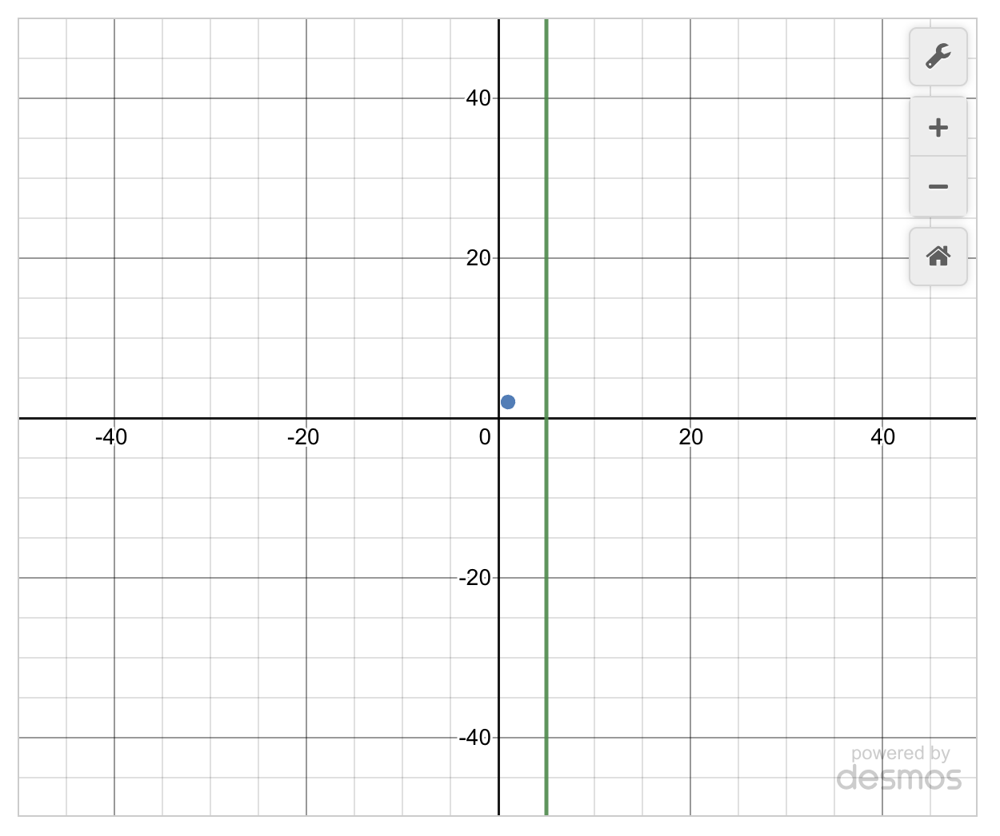

# Supporting interactive content for RAISE

One of the goals of the code in this repository is to support content developers in implementing interactive experiences within Moodle's standard Page and Lesson activities which may otherwise be constrained to static HTML. Moreover, the implementations are intended to allow for generating event data that can be provided to researchers. We define the following abstractions accordingly:

* **Interactive Block**: A basic primitive that can be combined with others to implement interactive content. The core value here is that for content developers an Interactive Block is described in HTML markup without any concern for the underlying implementation (e.g. the HTML / Javascript / CSS code that brings it to life).

* **Content Template**: A combination of one or more Interactive Blocks that represents a specific interactive experience.

This document provides schema definitions for supported Interactive Blocks as well as examples of Content Templates.

* Interactive Blocks
  * [Content-only Block](#content-only-block)
  * [Call-to-action (CTA) block](#call-to-action-cta-block)
  * [User input block](#user-input-block)
  * [Content tooltip block](#content-tooltip-block)
  * [Problem set block](#problem-set-block)
  * [Desmos graphing calculator block](#desmos-graphing-calculator-block)
* Content Templates
  * [Segmented content](#segmented-content)

## Interactive Blocks

This section provides a description and schema template for each Interactive Block.

:warning: All Interactive Blocks must be implemented at the top level of HTML content (e.g. they should not be nested within other content or `<div>`s). They can have peer elements which are not Interactive Blocks.

### Content-only block

#### Description

The Content-only block is used to wrap HTML content which should be conditionally rendered based upon an event from another block.

#### Schema definition

```html
<div class="os-raise-ib-content" data-wait-for-event="eventname" data-schema-version="1.0">
  <!-- INSERT ANY VALID HTML HERE -->
  <p>Content Input block</p>
</div>
```
The output if the `data-wait-for-event="eventname"` attribute is removed.

<div style="text-align: center;">
    
</div>


Notes on schema:

* The `data-wait-for-event` attribute is optional and where specified should correspond to a `data-fire-event` from another Interactive Block on the same page (e.g. as part of a Content Template)

### Call-to-action (CTA) block

#### Description

The Call-to-action (CTA) block encapsulates the following components:

* Content HTML
* Prompt HTML
* A button which can be clicked by the user

When the button is clicked, the component will:

* Fire the named event if defined (see schema definition)
* Disable the button

#### Schema definition

Default styling

```html
<div class="os-raise-ib-cta" data-button-text="Solution" data-fire-event="eventnameX" data-wait-for-event="eventnameY" data-schema-version="1.0">
  <div class="os-raise-ib-cta-content">
    <!-- INSERT ANY VALID HTML HERE -->
    <p>CTA block content</p>
  </div>
  <div class="os-raise-ib-cta-prompt">
    <!-- INSERT ANY VALID HTML HERE -->
    <p>Click button to see solution</p>
  </div>
</div>
```

Theme styling

```html
<div class="os-raise-ib-cta" data-button-text="Reveal Challenge" data-style-theme="green" data-fire-event="eventnameX" data-wait-for-event="eventnameY" data-schema-version="1.0">
  <div class="os-raise-ib-cta-content">
    <!-- INSERT ANY VALID HTML HERE -->
    <p>CTA block content</p>
  </div>
  <div class="os-raise-ib-cta-prompt">
    <!-- INSERT ANY VALID HTML HERE -->
    <p>Click button to see solution</p>
  </div>
</div>
```

The output if the `data-wait-for-event="eventnameX"` attribute is removed. This is also the default styling without applying the optional attribute `data-style-theme`:

<div style="text-align: center;">
    
</div>

The output when applying the optional attribute `data-style-theme`:
<div style="text-align: center;">
    
</div>

Notes on schema:

* The `data-wait-for-event` attribute is optional and where specified should correspond to a `data-fire-event` from another Interactive Block on the same page (e.g. as part of a Content Template)
* The `data-fire-event` attribute is optional
* The `data-button-text` is optional but allows the content developer to customize the text in the CTA button. The default value is `Next`.
* The `data-style-theme` attribute is optional and when specified will provide the styling shown above.
* Supported values for `data-style-theme`: `green`.

### User input block

#### Description

The User input block provides a `<textarea>` for user input and is intended to provide a flexible method to allow students to provide longer form input to question prompts (e.g. beyond the problem set use case). It encapsulates the following components:

* Content HTML
* Prompt HTML
* A [textarea](https://developer.mozilla.org/en-US/docs/Web/HTML/Element/textarea) HTML element
* A button which can be clicked by the user to submit the form
* Acknowledgement HTML

When the button is clicked, the component will:

* Fire the named event if defined (see schema definition)
* Disable the text input box
* Disable the button
* Display the acknowledgement HTML

If students are entering something into a text block, be sure to follow these conventions:

- Use the phrase “Enter your answer here:” to prompt students.
- Use the phrase “Compare your answer:” at the beginning of the displayed answer in the acknowledgement HTML if it is showing a solution.

#### Schema definition

```html
<div class="os-raise-ib-input" data-button-text="ButtonText" data-fire-event="eventnameX" data-wait-for-event="eventnameY" data-schema-version="1.0">
  <div class="os-raise-ib-input-content">
    <!-- INSERT ANY VALID HTML HERE -->
    <p>Input content... </p>
  </div>
  <div class="os-raise-ib-input-prompt">
    <!-- INSERT ANY VALID HTML HERE -->
    <p>Enter your answer here: </p>

  </div>
  <div class="os-raise-ib-input-ack">
    <!-- INSERT ANY VALID HTML HERE -->
    <p>“Compare your answer: ... </p>
  </div>
</div>
```

The output if the `data-wait-for-event="eventnameY"` attribute is removed and the user submits an answer.

<div style="text-align: center;">
    
</div>

Notes on schema:

* The `data-wait-for-event` attribute is optional and where specified should correspond to a `data-fire-event` from another Interactive Block on the same page (e.g. as part of a Content Template)
* The `data-fire-event` attribute is optional
* The `data-button-text` is optional but allows the content developer to customize the text in the CTA button. The default value is `Submit`.

### Problem set block

#### Description

A problem set consists of a wrapping problem set definition and one or more problems. It encapsulates the following components:

* Problem set definition
* Correct response HTML
* Encouragement response HTML
* Multiple problems (which can be of different supported types) and corresponding content HTML with the problem itself

Users can attempt to answer questions and check their solution. Retries are allowed by default, but a limit can be defined. Whenever a question is checked, the Correct response or Encouragement response HTML is displayed depending on whether the solution is matched or not respectively. The component fires events when the problem set is "completed" (all problems are either solved or hit the retry limit).

#### Schema definition

```html
<div class="os-raise-ib-pset" data-fire-success-event="eventnameX" data-fire-learning-opportunity-event="eventnameY" data-wait-for-event="eventnameZ" data-retry-limit="3" data-button-text="Check" data-schema-version="1.0">
  <div class="os-raise-ib-pset-problem" data-problem-type="input" data-solution="42" data-problem-comparator="integer">
    <div class="os-raise-ib-pset-problem-content">
      <!-- INSERT ANY VALID HTML HERE -->
      <p>Input problem content</p>
    </div>
  </div>
  <div class="os-raise-ib-pset-problem" data-problem-type="dropdown" data-solution="red" data-solution-options='["red", "blue", "green"]'>
    <div class="os-raise-ib-pset-problem-content">
      <!-- INSERT ANY VALID HTML HERE -->
      <p>Dropdown problem content</p>
    </div>
  </div>
  <div class="os-raise-ib-pset-problem" data-problem-type="multiplechoice" data-solution="red" data-solution-options='["red", "blue", "green"]'>
    <div class="os-raise-ib-pset-problem-content">
      <!-- INSERT ANY VALID HTML HERE -->
      <p>Multiple choice problem content</p>
    </div>
  </div>
  <div class="os-raise-ib-pset-problem" data-problem-type="multiselect" data-solution='["red", "blue"]' data-solution-options='["red", "blue", "green"]'>
    <div class="os-raise-ib-pset-problem-content">
      <!-- INSERT ANY VALID HTML HERE -->
      <p>Multiselect problem content</p>
    </div>
  </div>
  <div class="os-raise-ib-pset-correct-response">
    <!-- INSERT ANY VALID HTML HERE -->
    <p>Correct Answer!</p>
  </div>
  <div class="os-raise-ib-pset-encourage-response">
    <!-- INSERT ANY VALID HTML HERE -->
    <p>Encouragement!</p>
  </div>
</div>
```

The output if the `data-wait-for-event="eventnameZ"` attribute is removed.

<div style="text-align: center;">
    
</div>
<div style="text-align: center;">
    
</div>
<div style="text-align: center;">
    
</div>
<div style="text-align: center;">
    
</div>


##### Problem specific overrides:

The schema outlined above provides content developers the ability to define HTML to be displayed when problems are checked and found to be correct or not. These can also be optionally defined at the problem level to override with specific feedback. An example of using this feature in the `input` problem from above:

```html
<div class="os-raise-ib-pset-problem" data-problem-type="input" data-solution="42" data-problem-comparator="integer">
  <div class="os-raise-ib-pset-problem-content">
    <!-- INSERT ANY VALID HTML HERE -->
  </div>
  <div class="os-raise-ib-pset-correct-response">
    <!-- INSERT ANY VALID HTML HERE WITH PROBLEM SPECIFIC RESPONSE -->
  </div>
  <div class="os-raise-ib-pset-encourage-response">
    <!-- INSERT ANY VALID HTML HERE WITH PROBLEM SPECIFIC RESPONSE-->
  </div>
</div>
```

The schema also allows developers to display HTML when specific answers are given to problems. These are defined at the problem level, as shown below, and use the `data-answer` attribute to match on the provided answer. The value passed to `data-answer` should match the schema for providing `data-solutions` to any problem type. An example is shown below for the `multiselect` problem type:

```html
<div class="os-raise-ib-pset-problem" data-problem-type="multiselect" data-solution='["red", "blue"]' data-solution-options='["red", "blue", "green"]'>
  <div class="os-raise-ib-pset-problem-content">
    <!-- INSERT ANY VALID HTML HERE -->
  </div>
  <div class="os-raise-ib-pset-encourage-response" data-answer='["blue"]'>
    <!-- INSERT ANY VALID HTML HERE -->
  </div>
  <div class="os-raise-ib-pset-encourage-response" data-answer='["green", "blue"]'>
    <!-- INSERT ANY VALID HTML HERE -->
  </div>
</div>
```

Individual problems can also display HTML for when users exhaust the amount of attempts that are alotted for a problem in a problemset. An example is shown below for a `multiplechoice` type question.

```html
<div class="os-raise-ib-pset-problem" data-problem-type="multiplechoice" data-solution="red" data-solution-options='["red", "blue", "green", "yellow"]'>
  <div class="os-raise-ib-pset-problem-content">
    <!-- INSERT ANY VALID HTML HERE -->
  </div>
  <div class='os-raise-ib-pset-attempts-exhausted-response'>
    <!-- INSERT ANY VALID HTML HERE -->
  </div>
</div>
```

The schema outlined above provides content developers the ability to define `data-retry-limit` for all problems within a problem set block. The schema also allows developers to define `data-retry-limit` for each individual problem, which will override the `data-retry-limit` set at the problem set block level. In the example shown below, the first problem will have a `data-retry-limit` of `4` (overriding the problem set block level `data-retry-limit` of `3`), but the second problem will inherit the `data-retry-limit` value of `3`.

```html
<div class="os-raise-ib-pset" data-fire-success-event="eventnameX" data-fire-learning-opportunity-event="eventnameY" data-wait-for-event="eventnameZ" data-retry-limit="3" data-button-text="Check" data-schema-version="1.0">
  <div class="os-raise-ib-pset-problem" data-retry-limit="4" data-problem-type="input" data-solution="42" data-problem-comparator="integer">
    <div class="os-raise-ib-pset-problem-content">
      <!-- INSERT ANY VALID HTML HERE -->
      <p>Input problem content</p>
    </div>
  </div>
  <div class="os-raise-ib-pset-problem" data-problem-type="dropdown" data-solution="red" data-solution-options='["red", "blue", "green"]'>
    <div class="os-raise-ib-pset-problem-content">
      <!-- INSERT ANY VALID HTML HERE -->
      <p>Dropdown problem content</p>
    </div>
  </div>
  <div class="os-raise-ib-pset-correct-response">
    <!-- INSERT ANY VALID HTML HERE -->
    <p>Correct Answer!</p>
  </div>
  <div class="os-raise-ib-pset-encourage-response">
    <!-- INSERT ANY VALID HTML HERE -->
    <p>Encouragement!</p>
  </div>
</div>
```

##### Attributes for the problem set:
* The `data-wait-for-event` attribute is optional and where specified should correspond to a `data-fire-event` from another Interactive Block on the same page (e.g. as part of a Content Template)
* `data-retry-limit` is optional and defaults to `0` (one attempt with no retries). If specified it should be a positive value indicating the number of retry attempts allowed. Note that each button "click" counts as an attempt, so a retry limit of 1 means they can submit up to two times.
* `data-button-text` is optional but allows the content developer to customize the text in the button associated with each question that allows users to check their answers. The default value is `Check`.
* The `data-fire-success-event` and `data-fire-learning-opportunity-event` attributes are optional
  * `data-fire-success-event` - This event is fired by the block if the student is deemed to have completed the problem set without difficulty according to some built-in function.
  * `data-fire-learning-opportunity-event` - This event is fired by the block if it is deemed that the problem set has surfaced a potential learning opportunity according to some built-in function

##### Attributes for all problem types:
* `data-problem-type`: Valid values include `input`, `dropdown`, `multiselect`, `multiplechoice`
* `data-retry-limit` is optional and does not default to `0`, but rather it will be `undefined`. If specified it: (1) will override the `data-retry-limit` set at the problem set level and (2) should be a positive value indiciating the number of retry attempts allowed. Note that each button "click" counts as an attempt, so a retry limit of 1 means they can submit up to two times.
* `data-solution` is required. It is used by each problem type as follows:
  * `input` question: The solution string is compared to the user input based upon the prescribed comparator (see options below)
  * `dropdown` question: The solution string should match one of the options in the array passed as `data-solution-options` (see details below)
  * `multiplechoice` question: The solution string should match one of the options in the array passed as `data-solution-options` (see details below)
  * `multiselect` question: The solution string should be a JSON array with the set of answers that are correct. For example, if `data-solution-options='["Option 1", "Option2", "Option 3"]'` is used, than `data-solution='["Option2", "Option 3"]'` designates that the user should select `Option 2` and `Option 3` to answer correctly.

##### Attributes specific to `input` problem type:
* Valid values for `data-problem-comparator` include: `integer`, `float`, `text`, `math`
  * If the comparator is `integer` or `float`, user input will be converted to values of the corresponding type before comparing
  * If the comparator is `text`, user input is compared using a case-insensitive match
  * If the comparator is `math`, the user will have access to an equation editor keyboard. User input will be converted to values that will be compared for mathematical equvalancy. The `data-solution` attribute must be a valid LaTeX expression

##### Attributes specific to `dropdown` problem type:
* `data-solution-options` should be a JSON array with a list of choices. For example: `data-solution-options='["Option 1", "Option2", "Option 3"]'"`

##### Attributes specific to `multiplechoice` problem type:
* `data-solution-options` should be a JSON array with a list of choices. For example: `data-solution-options='["Option 1", "Option2", "Option 3"]'"`

##### Attributes specific to `multiselect` problem type:
* `data-solution-options` should be a JSON array with a list of choices. For example: `data-solution-options='["Option 1", "Option2", "Option 3"]'"`

#### Using MathJax math in `data-solution` and `data-solution-options` attributes

The `multiselect` and `multiplechoice` problem types support using MathJax math with `\(` and `\)` delimeters in the solution choices. However, the backslashes must be escaped when used in JSON array strings. Examples of for both problem types:

```html
<div class="os-raise-ib-pset-problem" data-problem-type="multiplechoice" data-solution="\( x^2 \)" data-solution-options='["\\( x^2 \\)", "\\( x+2 \\)", "\\( \\frac{2*x}{3} \\)"]'>
```

```html
<div class="os-raise-ib-pset-problem" data-problem-type="multiselect" data-solution='["\\( x^2 \\)", "\\( x+2 \\)"]' data-solution-options='["\\( x^2 \\)", "\\( x+2 \\)", "\\( 2*x \\)"]'>
```

### Content tooltip block

#### Description

A Content tooltip block is an in-line block which allows content developers to associate a `<span>` element with a datastore. The datastore consists of keys and values, and if the text within the `<span>` matches a key (case-insensitive match). A datastore can be referenced in attributes by dropping the extension (e.g. the datastore in `mydata.json` can be referenced as name `mydata`). The content block encapsulates the following components:

* A tooltip displayed on hover / focus

#### Schema definition

```html
<span class="os-raise-ib-tooltip" data-store="storename" data-schema-version="1.0"><!-- INSERT TERM HERE --></span>
```

### Desmos graphing calculator block

#### Description

The Desmos graphing calculator block displays a graph and an expressions panel. Add expressions to the graph by passing a JSON array into the optional `data-equations` attribute, where each element represents a new equation or point that will be added to the expressions panel. Tables can be added to the expressions panel by adding a JSON array to the `data-tables` attribute. The tables will show up first in the expressions panel. The `data-bottom`, `data-top`, `data-left`, and `data-right` attributes take number values and define where the graph viewport sits. If only the graph is needed, the expressions panel can be removed by passing the optional `data-disable-expressions` attribute. The size of the Desmos interactive can be set by passing an integer value into the `data-width` and `data-height` attributes. 

#### Schema definition

The following template provides an example with a Desmos graphing calculator block. 

```html
<div class="os-raise-ib-desmos-gc" data-wait-for-event="eventnameY"  data-height="500" data-width="600"  data-equations='["(1,2)","x=5"]'  data-disable-expressions data-top="50" data-bottom="-50" data-left="-50" data-right="50" data-schema-version="1.0">
</div>
```


The output if the `data-wait-for-event="eventnameY"` attribute is removed.

<div style="text-align: center;">
    
</div>

The following template is an example with two tables

```html
<div class="os-raise-ib-desmos-gc" data-wait-for-event="eventnameY"  data-height="500" data-width="600"  data-equations='["(1,2)","x=5"]' data-tables='[[{"variable": "x_1", "values": [1, 2]}, {"variable": "x_2", "values": [3, 5]}],[{"variable": "x_3", "values": [10, 13]},{"variable": "x_4", "values": [7, -4]}]]'  data-disable-expressions data-top="50" data-bottom="-50" data-left="-50" data-right="50" data-schema-version="1.0">
</div>
```

The output if the `data-wait-for-event="eventnameY"` and `data-disable-expressions` attributes are removed.

<div style="text-align: center;">
    
</div>

Notes on schema:

* The `data-wait-for-event` attribute is optional and where specified should correspond to a `data-fire-event` from another Interactive Block on the same page (e.g. as part of a Content Template)
* The height and width attributes are optional and the default is 500 by 400 pixels.
* The default values for the optional `data-bottom`, `data-top`, `data-left`, and `data-right` attributes are 10 for the top and right and -10 for bottom and left. 
* if you just want to render a graphing calculator with nothing pre-graphed you can do so with `<div class="os-raise-ib-desmos-gc" data-schema-version="1.0"></div>`

## Content Templates

As mentioned previously, Content Templates are comprised of multiple Interactive Blocks. Here we provide examples of supported Content Templates which target specific use cases discussed with the content development team.

### Segmented content

#### Description

The Segmented content template combines CTA blocks and a Content-only block to create a page where users can gradually expose new content. It is intended to reduce cognitive load for what would otherwise be single, long pages.

#### Schema definition

The following template provides an example with two CTA blocks and a terminal Content-only block. The number of CTA blocks included in this template are up to the content developer.

```html
<div class="os-raise-ib-cta" data-button-text="Show more" data-fire-event="section1" data-schema-version="1.0">
  <div class="os-raise-ib-cta-content">
    <!-- INSERT ANY VALID HTML HERE -->
  </div>
  <div class="os-raise-ib-cta-prompt">
    <!-- INSERT ANY VALID HTML HERE -->
  </div>
</div>
<div class="os-raise-ib-cta" data-button-text="Show more" data-fire-event="section2" data-wait-for-event="section1" data-schema-version="1.0">
  <div class="os-raise-ib-cta-content">
    <!-- INSERT ANY VALID HTML HERE -->
  </div>
  <div class="os-raise-ib-cta-prompt">
    <!-- INSERT ANY VALID HTML HERE -->
  </div>
</div>
<div class="os-raise-ib-content" data-wait-for-event="section2" data-schema-version="1.0">
  <!-- INSERT ANY VALID HTML HERE -->
</div>
```

