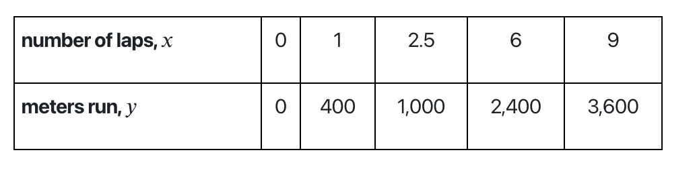

# Styling content for RAISE

In order to maintain consistency and reliability across all RAISE content, the styling associated with RAISE content is consolidated into a series of css classes located in `src/styles`. RAISE Style classes are either written for specific elements, or can be applied to a variety of objects. Those differences are listed below.


***


## Standard Table

Adds a solid border and padding to a table.

**Example**
<div style="text-align: center;">
    
</div>


**Aviliability**
Add as a class atribute to a table html tag.

**Usage**

```html
  <table class="os-raise-standardtable">
  <tr>
    <th>Company</th>
    <th>Contact</th>
    <th>Country</th>
  </tr>
  <tr>
    <td>Alfreds Futterkiste</td>
    <td>Maria Anders</td>
    <td>Germany</td>
  </tr>
  <tr>
    <td>Centro comercial Moctezuma</td>
    <td>Francisco Chang</td>
    <td>Mexico</td>
  </tr>
</table>
```

***

## Gray Box (os-raise-graybox)

Add a Gray box around your element

**Example**
<div style="text-align: center;">
    
</div>

**Availability**
Grayboxes should be used in div elements only


**Usage**
```html
<div class="os-raise-graybox">
    <p> Image Title</p>
    </img>
</div>
```

***

## Indent (os-raise-indent)

Add a padding to the left side of an element. If the element already includes a left padding (like an ordered list) the indent will get set to exactly 2rem

**Example**
<div style="text-align: center;">
    
</div>


**Availability**

Any element

**Usage**

```html
<p class="os-raise-indent">Text in a box</p>
```

***

## No-Indent (os-raise-noindent)

Remove the indent inherent in an ordered list.

**Example**
<div style="text-align: center;">
    
</div>


**Availability**

Ordered list objects

**Usage**

```html
<ol class="os-raise-noindent">
    <li>Item A</li>
    <li>Item B</li>
    <li>Item C</li>
</ol>
```

***
