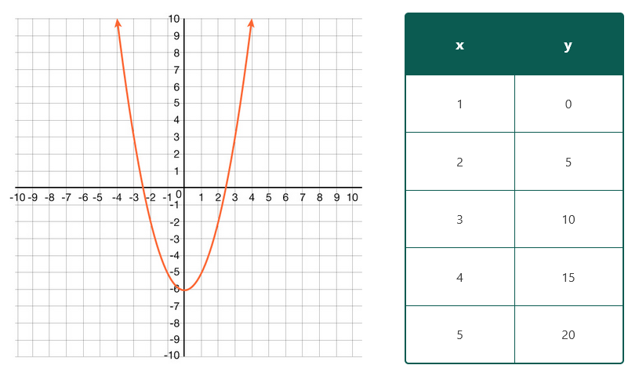

# Styling content for RAISE

In order to maintain consistency and reliability across all RAISE content, the styling associated with RAISE content is consolidated into a series of css classes located in `src/styles`. RAISE Style classes are either written for specific elements, or can be applied to a variety of objects. Those differences are listed below.

---

## Text Heavy Table

Adds a solid border, styled table header, and padding to a fixed-width table that contains multi-line text.

**Example**

<div style="text-align: center;">
    
</div>

**Availability**

Add as a class attribute to a table html tag.

**Usage**

```html
<table class="os-raise-textheavytable">
  <caption> Texas Essential Knowledge and Skills (TEKS)
  <thead>
    <tr>
      <th scope="col">TEKS</th>
      <th scope="col">Explination of Coverage</th>
    </tr>
  </thead>
  <tbody>
    <tr>
      <td>
        <p>A11(B) simplfy numeric and algebraic expressions using the laws of exponents, including integral and rational exponents</p>
      </td>
      <td>
        <p>Partial coverage: Lesson provides content that covers part of this TEKS. The parts that are covered have been underlined</p>
      </td>
    </tr>
  </tbody>
</table>
```

---

## Horizontal Table

Adds a solid border, styled header cell, and padding to a horizontal table.

**Example**

<div style="text-align: center;">
    
</div>

**Availability**

Add as a class attribute to a table html tag.

**Usage**

```html
<table class="os-raise-horizontaltable">
  <tbody>
    <tr>
      <th scope="row">Time (years)</th>
      <td>5</td>
      <td>1</td>
      <td>0</td>
      <td>-1</td>
      <td>-2</td>
    </tr>
    <tr>
      <th scope="row">Volume of Coral (cubic centimeters)</th>
      <td>a.___</td>
      <td>b.___</td>
      <td>c.___</td>
      <td>d.___</td>
      <td>e.___</td>
    </tr>
  </tbody>
</table>
```

---

## Mid-Size Table

Adds a solid border, styled table header, and padding to a centered, fixed-width, mid-size table.

**Example**

<div style="text-align: center;">
    
</div>

**Availability**

Add as a class attribute to a table html tag.

**Usage**

```html
<table class="os-raise-midsizetable">
  <thead>
    <tr>
      <th scope="col">Hour</th>
      <th scope="col">Number of Bacteria</th>
    </tr>
  </thead>
  <tbody>
    <tr>
      <td>0</td>
      <td>500</td>
    </tr>
    <tr>
      <td>1</td>
      <td>a.____</td>
    </tr>
    <tr>
      <td>2</td>
      <td>b.____</td>
    </tr>
    <tr>
      <td>3</td>
      <td>c.____</td>
    </tr>
    <tr>
      <td>6</td>
      <td>d.____</td>
    </tr>
    <tr>
      <td>t</td>
      <td>e.____</td>
    </tr>
  </tbody>
</table>
```

---

## Skinny Table

Adds a solid border, styled table header, and padding to a fixed-width skinny table.

**Example**

<div style="text-align: center;">
    
</div>

**Availability**

Add as a class attribute to a table html tag.

**Usage**

```html
<div class="os-raise-d-flex os-raise-justify-content-between">
  
  <table class="os-raise-skinnytable">
    <thead>
      <tr>
        <th scope="col">x</th>
        <th scope="col">y</th>
      </tr>
    </thead>
    <tbody>
      <tr>
        <td>1</td>
        <td>0</td>
      </tr>
      <tr>
        <td>2</td>
        <td>5</td>
      </tr>
      <tr>
        <td>3</td>
        <td>10</td>
      </tr>
      <tr>
        <td>4</td>
        <td>15</td>
      </tr>
      <tr>
        <td>5</td>
        <td>20</td>
      </tr>
    </tbody>
  </table>
</div>
```

---

## Wide Equal Column Table

Adds a solid border, styled table header, and padding to a fixed-width table with equal column width.

**Example**

<div style="text-align: center;">
    
</div>

**Availability**

Add as a class attribute to a table html tag.

**Usage**

```html
<table class="os-raise-wideequaltable">
  <thead>
    <tr>
      <th scope="col">Expression</th>
      <th scope="col">To multiple like bases, add the exponents.</th>
      <th scope="col">Simplified Result - Simplified Result</th>
    </tr>
  </thead>
  <tbody>
    <tr>
      <td>\(n\)</td>
      <td>\((2)^2\) = \((-2)\)\((-2)\)</td>
      <td>\(2\)</td>
    </tr>
    <tr>
      <td>\(n^2\)</td>
      <td></td>
      <td></td>
    </tr>
    <tr>
      <td>\(n^3\)</td>
      <td></td>
      <td></td>
    </tr>
    <tr>
      <td>\(n^4\)</td>
      <td></td>
      <td></td>
    </tr>
    <tr>
      <td>\(n^5\)</td>
      <td></td>
      <td></td>
    </tr>
  </tbody>
</table>
```

---

## Wide Adjusted Table

Adds a solid border, styled table header, and padding to a table with column widths determined by the widest content in a column.

**Example**

<div style="text-align: center;">
    
</div>

**Availability**

Add as a class attribute to a table html tag.

**Usage**

```html
<table class="os-raise-wideadjustedtable">
  <thead>
    <tr>
      <th scope="col">Expression</th>
      <th scope="col">To multiple like bases, add the exponents.</th>
      <th scope="col">Simplified Result</th>
    </tr>
  </thead>
  <tbody>
    <tr>
      <td>\(n\)</td>
      <td>\((2)^2\) = \((-2)\)\((-2)\)</td>
      <td>\(2\)</td>
    </tr>
    <tr>
      <td>\(n^2\)</td>
      <td></td>
      <td></td>
    </tr>
    <tr>
      <td>\(n^3\)</td>
      <td></td>
      <td></td>
    </tr>
    <tr>
      <td>\(n^4\)</td>
      <td></td>
      <td></td>
    </tr>
    <tr>
      <td>\(n^5\)</td>
      <td></td>
      <td></td>
    </tr>
  </tbody>
</table>
```

---

## Double Header Table

Adds a solid border, styled table/cell headers, and padding to a fixed-width table with an empty first column cell.

**Example**

<div style="text-align: center;">
    
</div>

**Availability**

Add as a class attribute to a table html tag.

**Usage**

```html
<table class="os-raise-doubleheadertable">
  <thead>
    <tr>
      <th></th>
      <th scope="col">\(x\)</th>
      <th scope="col">\(+7\)</th>
    </tr>
  </thead>
  <tbody>
    <tr>
      <th scope="rowl">\(x\)</th>
      <td>\(x^2\)</td>
      <td>\(7x\)</td>
    </tr>
    <tr>
      <th scope="row">\(+9\)</th>
      <td>\(9x\)</td>
      <td>\(63\)</td>
    </tr>
  </tbody>
</table>
```

---

## Gray Box (os-raise-graybox)

Add a Gray box around your element

**Example**

<div style="text-align: center;">
    
</div>

**Availability**
Grayboxes should be used in div elements only

**Usage**

```html
<div class="os-raise-graybox">
    <p> Image Title</p>
    </img>
</div>
```

---

## Indent (os-raise-indent)

Add a padding to the left side of an element. If the element already includes a left padding (like an ordered list) the indent will get set to exactly 2rem

**Example**

<div style="text-align: center;">
    
</div>

**Availability**

Any element

**Usage**

```html
<p class="os-raise-indent">Text in a box</p>
```

---

## No-Indent (os-raise-noindent)

Remove the indent inherent in an ordered list.

**Example**

<div style="text-align: center;">
    
</div>

**Availability**

Ordered list objects

**Usage**

```html
<ol class="os-raise-noindent">
  <li>Item A</li>
  <li>Item B</li>
  <li>Item C</li>
</ol>
```

---

## Motivational Content (os-raise-motivation)

Add a styled motivational message into the content

**Example**

<div style="text-align: center;">
    
</div>

**Availability**

Div objects only

**Usage**

```html
<div class="os-raise-motivation">
  <p>You got this! If you believe that you can figure it out you can!</p>
</div>
```

---

## Side by side (os-raise-d-flex)

Add to any tag surrounding side by side content.

**Example**

<div style="text-align: center;">
    
</div>

**Availability**

Any element

**Usage**

You can append the additional styles to class attribute to add more styling to
the side by side content.

- `os-raise-align-items-center` centers the side by side content vertically.
- `os-raise-justify-content-center` centers the grid horizontally.
- `os-raise-justify-content-between` adds even spacing between content starting after the first element and ending before the last.
- `os-raise-justify-content-evenly` adds even spacing between content including before the first and after the last element.

```html
<div class="os-raise-d-flex os-raise-align-items-center">
  <p>Element 1</p>
  <p>Element 2</p>
  <p>Element 3</p>
</div>
```

## Centered text (os-raise-text-center)

This utility class can be applied to center content using the [`text-align` CSS property](https://developer.mozilla.org/en-US/docs/Web/CSS/text-align).

**Example**

<div style="text-align: center;">
    
</div>

**Availability**

Any block element or table-cell box (e.g. any element where `text-align` CSS property can apply).

**Usage**

```html
<p></p>
<p class="os-raise-text-center">
  
</p>

<table class="os-raise-standardtable">
  <tr>
    <th class="os-raise-text-center">Centered heading</th>
    <th>Default heading</th>
  </tr>
  <tr>
    <td>
      <p>
        Lorem ipsum dolor sit amet, consectetur adipiscing elit, sed do eiusmod
        tempor incididunt ut labore et dolore magna aliqua. Ut enim ad minim
        veniam, quis nostrud exercitation ullamco laboris nisi ut aliquip ex ea
        commodo consequat. Duis aute irure dolor in reprehenderit in voluptate
        velit esse cillum dolore eu fugiat nulla pariatur. Excepteur sint
        occaecat cupidatat non proident, sunt in culpa qui officia deserunt
        mollit anim id est laborum.
      </p>
    </td>
    <td>
      <p>
        Lorem ipsum dolor sit amet, consectetur adipiscing elit, sed do eiusmod
        tempor incididunt ut labore et dolore magna aliqua. Ut enim ad minim
        veniam, quis nostrud exercitation ullamco laboris nisi ut aliquip ex ea
        commodo consequat. Duis aute irure dolor in reprehenderit in voluptate
        velit esse cillum dolore eu fugiat nulla pariatur. Excepteur sint
        occaecat cupidatat non proident, sunt in culpa qui officia deserunt
        mollit anim id est laborum.
      </p>
    </td>
  </tr>
</table>
```
