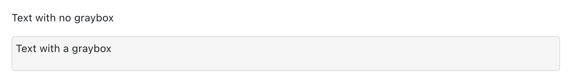

# Table of Contents

- Purpose behind this markdown
  - [Styling Content for RAISE](#styling-content-for-raise)
- Tables
  - [Text Heavy Tables](#text-heavy-table)
  - [Text Heavy Adjusted Tables](#text-heavy-adjusted-table)
  - [Horizontal Tables](#horizontal-table)
  - [Mid-Sized Tables](#mid-size-table)
  - Skinny Tables
    - [Skinny Table w/Media](#skinny-table-table--media)
    - [Three Skinny Tables](#skinny-table-three-tables)
  - Wide Tables
    - [Equal Column Wide Tables](#wide-equal-column-table)
    - [Adjustable Column Wide Tables](#wide-adjusted-table)
  * [Double Header Tables](#double-header-table)
* Spacing
  - Margin
    - [No Bottom Margin](#no-margin-bottom-os-raise-mb-0)
    - [Center w/Auto Margin](#margin-auto-os-raise-mx-auto)
  - Indentation
    - [Indent](#indent-os-raise-indent)
    - [No Indent](#no-indent-os-raise-noindent)
  - Text Centering
    - [Center Text Horizontally](#centered-text-os-raise-text-center)
* Layout
  - Flex
    - Initialization of Flex Box
      - [Required Flex Class](#side-by-side-os-raise-d-flex)
    - Content Positioning
      - [Center Side-by-Side Content Vertically](#side-by-side-os-raise-d-flex)
      - [Center Side-by-Side Content Horizontally](#side-by-side-os-raise-d-flex)
      - [Add Space Between Side-by-Side Content](#side-by-side-os-raise-d-flex)
      - [Add Space Equally Around Side-by-Side Content](#side-by-side-os-raise-d-flex)
* Components
  - [Gray Box](#gray-box-os-raise-graybox)
  - [Motivational Message](#motivational-content-os-raise-motivation)
* Text Styling
  - [Bold Text](#bold-text)
* Media Styling
  - [Responsive Media](#responsive-media)
  - [Responsive iframe](#responsive-iframe)

# Styling Content for RAISE

In order to maintain consistency and reliability across all RAISE content, the styling associated with RAISE content is consolidated into a series of css classes located in `src/styles`. RAISE Style classes are either written for specific elements, or can be applied to a variety of objects. Those differences are listed below.

---

## Text Heavy Table

Adds a solid border, styled table header, and padding to a fixed-width table that contains multi-line text.

**Example**

<div style="text-align: center;">
    
</div>

**Availability**

Add as a class attribute to a table html tag.

**Usage**

```html
<table class="os-raise-textheavytable">
  <caption> Texas Essential Knowledge and Skills (TEKS)
  <thead>
    <tr>
      <th scope="col">TEKS</th>
      <th scope="col">Explanation of Coverage</th>
    </tr>
  </thead>
  <tbody>
    <tr>
      <td>
        <p>A11(B) simplfy numeric and algebraic expressions using the laws of exponents, including integral and rational exponents</p>
      </td>
      <td>
        <p>Partial coverage: Lesson provides content that covers part of this TEKS. The parts that are covered have been underlined</p>
      </td>
    </tr>
  </tbody>
</table>
```

---

## Text Heavy Adjusted Table

Adds a solid border, styled table header, and padding to a table with column widths determined by the widest content in a column.

**Example**

<div style="text-align: center;">
    
</div>

**Availability**

Add as a class attribute to a table html tag.

**Usage**

```html
<table class="os-raise-textheavyadjustedtable">
  <thead>
    <tr>
      <th scope="col">Lesson Number</th>
      <th scope="col">Lesson Title</th>
      <th scope="col">Associated Texas Essential Knowledge and Skills [TEKS]</th>
    </tr>
  </thead>
  <tbody>
    <tr>
      <td>1.1</td>
      <td>Exploring Expressions and Equations</td>
      <td><p>A1(A) apply mathematics to problems arising in everyday life, society, and the workplace</p>
        <p>A2(C) write linear equations in two variables given a table of values, a graph, and a verbal description</p></td>
    </tr>
    <tr>
      <td>1.2</td>
      <td>Writing Equations to Model Relationships (Part 1)</td>
      <td><p>A1(A) apply mathematics to problems arising in everyday life, society, and the workplace</p>
        <p>A2(C) write linear equations in two variables given a table of values, a graph, and a verbal description</p></td>
    </tr>
    <tr>
      <td>1.3</td>
      <td>Writing Equations to Model Relationships (Part 2)</td>
      <td><p>A1(A) apply mathematics to problems arising in everyday life, society, and the workplace</p>
        <p>A1(C) select tools, including real objects, manipulatives, paper and pencil, and technology as appropriate, and techniques, including mental math, estimation, and number sense as appropriate, to solve problems</p>
        <p>A2(C) write linear equations in two variables given a table of values, a graph, and a verbal description.</p></td>
    </tr>
    <tr>
      <td>1.4</td>
      <td>Equations and Their Solutions</td>
      <td><p>A1(A) apply mathematics to problems arising in everyday life, society, and the workplace</p>
        <p>A1(C) select tools, including real objects, manipulatives, paper and pencil, and technology as appropriate, and techniques, including mental math, estimation, and number sense as appropriate, to solve problems</p>
        <p>A2(C) write linear equations in two variables given a table of values, a graph, and a verbal description</p></td>
    </tr>
  </tbody>
</table>
```

---

## Horizontal Table

Adds a solid border, styled header cell, and padding to a horizontal table.

**Example**

<div style="text-align: center;">
    
</div>

**Availability**

Add as a class attribute to a table html tag.

**Usage**

```html
<table class="os-raise-horizontaltable">
  <thead></thead>
  <tbody>
    <tr>
      <th scope="row">Time (years)</th>
      <td>5</td>
      <td>1</td>
      <td>0</td>
      <td>-1</td>
      <td>-2</td>
    </tr>
    <tr>
      <th scope="row">Volume of Coral (cubic centimeters)</th>
      <td>a.___</td>
      <td>b.___</td>
      <td>c.___</td>
      <td>d.___</td>
      <td>e.___</td>
    </tr>
  </tbody>
</table>
```

---

## Mid-Size Table

Adds a solid border, styled table header, and padding to a centered, fixed-width, mid-size table.

**Example**

<div style="text-align: center;">
    
</div>

**Availability**

Add as a class attribute to a table html tag.

**Usage**

```html
<table class="os-raise-midsizetable">
  <thead>
    <tr>
      <th scope="col">Hour</th>
      <th scope="col">Number of Bacteria</th>
    </tr>
  </thead>
  <tbody>
    <tr>
      <td>0</td>
      <td>500</td>
    </tr>
    <tr>
      <td>1</td>
      <td>a.____</td>
    </tr>
    <tr>
      <td>2</td>
      <td>b.____</td>
    </tr>
    <tr>
      <td>3</td>
      <td>c.____</td>
    </tr>
    <tr>
      <td>6</td>
      <td>d.____</td>
    </tr>
    <tr>
      <td>t</td>
      <td>e.____</td>
    </tr>
  </tbody>
</table>
```

---

## Skinny Table (Table + Media)

Adds a solid border, styled table header, and padding to a fixed-width skinny table paired with a image.

**Example**

<div style="text-align: center;">
    
</div>

**Availability**

Add as a class attribute to a table html tag.

**Usage**

```html
<div class="os-raise-d-flex os-raise-justify-content-between">
  <div class="os-raise-mx-auto">
    
  </div>
  <table class="os-raise-skinnytable">
    <thead>
      <tr>
        <th scope="col">x</th>
        <th scope="col">y</th>
      </tr>
    </thead>
    <tbody>
      <tr>
        <td>1</td>
        <td>0</td>
      </tr>
      <tr>
        <td>2</td>
        <td>5</td>
      </tr>
      <tr>
        <td>3</td>
        <td>10</td>
      </tr>
      <tr>
        <td>4</td>
        <td>15</td>
      </tr>
      <tr>
        <td>5</td>
        <td>20</td>
      </tr>
    </tbody>
  </table>
</div>
```

---

## Skinny Table (Three Tables)

Adds a solid border, styled table header, and padding to three fixed-width skinny tables.

**Example**

<div style="text-align: center;">
    
</div>

**Availability**

Add as a class attribute to a table html tag.

**Usage**

```html
<div class="os-raise-d-flex os-raise-justify-content-between">
  <table class="os-raise-skinnytable">
    <thead>
      <tr>
        <th scope="col">x</th>
        <th scope="col">y</th>
      </tr>
    </thead>
    <tbody>
      <tr>
        <td>1</td>
        <td>0</td>
      </tr>
      <tr>
        <td>2</td>
        <td>5</td>
      </tr>
      <tr>
        <td>3</td>
        <td>10</td>
      </tr>
      <tr>
        <td>4</td>
        <td>15</td>
      </tr>
      <tr>
        <td>5</td>
        <td>20</td>
      </tr>
    </tbody>
  </table>
  <table class="os-raise-skinnytable">
    <thead>
      <tr>
        <th scope="col">x</th>
        <th scope="col">y</th>
      </tr>
    </thead>
    <tbody>
      <tr>
        <td>1</td>
        <td>0</td>
      </tr>
      <tr>
        <td>2</td>
        <td>5</td>
      </tr>
      <tr>
        <td>3</td>
        <td>10</td>
      </tr>
      <tr>
        <td>4</td>
        <td>15</td>
      </tr>
      <tr>
        <td>5</td>
        <td>20</td>
      </tr>
    </tbody>
  </table>
  <table class="os-raise-skinnytable">
    <thead>
      <tr>
        <th scope="col">x</th>
        <th scope="col">y</th>
      </tr>
    </thead>
    <tbody>
      <tr>
        <td>1</td>
        <td>0</td>
      </tr>
      <tr>
        <td>2</td>
        <td>5</td>
      </tr>
      <tr>
        <td>3</td>
        <td>10</td>
      </tr>
      <tr>
        <td>4</td>
        <td>15</td>
      </tr>
      <tr>
        <td>5</td>
        <td>20</td>
      </tr>
    </tbody>
  </table>
</div>
```

---

## Wide Equal Column Table

Adds a solid border, styled table header, and padding to a fixed-width table with equal column width.

**Example**

<div style="text-align: center;">
    
</div>

**Availability**

Add as a class attribute to a table html tag.

**Usage**

```html
<table class="os-raise-wideequaltable">
  <thead>
    <tr>
      <th scope="col">Expression</th>
      <th scope="col">To multiple like bases, add the exponents.</th>
      <th scope="col">Simplified Result - Simplified Result</th>
    </tr>
  </thead>
  <tbody>
    <tr>
      <td>\(n\)</td>
      <td>\((2)^2\) = \((-2)\)\((-2)\)</td>
      <td>\(2\)</td>
    </tr>
    <tr>
      <td>\(n^2\)</td>
      <td></td>
      <td></td>
    </tr>
    <tr>
      <td>\(n^3\)</td>
      <td></td>
      <td></td>
    </tr>
    <tr>
      <td>\(n^4\)</td>
      <td></td>
      <td></td>
    </tr>
    <tr>
      <td>\(n^5\)</td>
      <td></td>
      <td></td>
    </tr>
  </tbody>
</table>
```

---

## Wide Adjusted Table

Adds a solid border, styled table header, and padding to a table with column widths determined by the widest content in a column.

**Example**

<div style="text-align: center;">
    
</div>

**Availability**

Add as a class attribute to a table html tag.

**Usage**

```html
<table class="os-raise-wideadjustedtable">
  <thead>
    <tr>
      <th scope="col">Expression</th>
      <th scope="col">To multiple like bases, add the exponents.</th>
      <th scope="col">Simplified Result</th>
    </tr>
  </thead>
  <tbody>
    <tr>
      <td>\(n\)</td>
      <td>\((2)^2\) = \((-2)\)\((-2)\)</td>
      <td>\(2\)</td>
    </tr>
    <tr>
      <td>\(n^2\)</td>
      <td></td>
      <td></td>
    </tr>
    <tr>
      <td>\(n^3\)</td>
      <td></td>
      <td></td>
    </tr>
    <tr>
      <td>\(n^4\)</td>
      <td></td>
      <td></td>
    </tr>
    <tr>
      <td>\(n^5\)</td>
      <td></td>
      <td></td>
    </tr>
  </tbody>
</table>
```

---

## Double Header Table

Adds a solid border, styled table/cell headers, and padding to a fixed-width table with an empty first column cell.

**Example**

<div style="text-align: center;">
    
</div>

**Availability**

Add as a class attribute to a table html tag.

**Usage**

```html
<table class="os-raise-doubleheadertable">
  <thead>
    <tr>
      <th scope="col"></th>
      <th scope="col">\(x\)</th>
      <th scope="col">\(+7\)</th>
    </tr>
  </thead>
  <tbody>
    <tr>
      <th scope="row">\(x\)</th>
      <td>\(x^2\)</td>
      <td>\(7x\)</td>
    </tr>
    <tr>
      <th scope="row">\(+9\)</th>
      <td>\(9x\)</td>
      <td>\(63\)</td>
    </tr>
  </tbody>
</table>
```

---

## Gray Box (os-raise-graybox)

Add a Gray box around your element

**Example**

<div style="text-align: center;">
    
</div>

**Availability**
Grayboxes should be used in div elements only

**Usage**

```html
<div class="os-raise-graybox">
    <p> Image Title</p>
    </img>
</div>
```

---

## No margin-bottom (os-raise-mb-0)

Remove bottom margin from your element

**Example**

<div style="text-align: center;">
    
</div>

**Availability**

Any element with a default bottom margin

**Usage**

```html
<p>Text with bottom margin</p>
<p class="os-raise-mb-0">Text without bottom margin</p>
<p>Text with bottom margin</p>
```

---

## Margin auto (os-raise-mx-auto)

Horizontally center a block element within its container. The block element will take up the specified width and the remaining space is split equally between the left and right margin.

**Example**

<div style="text-align: center;">
    
</div>

**Availability**

Any child block element with a width smaller than its parent element.

**Usage**

```html
<div>
  <div class="os-raise-mx-auto"></div>
</div>
```

---

## Indent (os-raise-indent)

Add a padding to the left side of an element. If the element already includes a left padding (like an ordered list) the indent will get set to exactly 2rem

**Example**

<div style="text-align: center;">
    
</div>

**Availability**

Any element

**Usage**

```html
<p class="os-raise-indent">Indented text</p>
```

---

## No-Indent (os-raise-noindent)

Remove the indent inherent in an ordered list.

**Example**

<div style="text-align: center;">
    
</div>

**Availability**

Ordered list objects

**Usage**

```html
<ol class="os-raise-noindent">
  <li>Not Indented item 1</li>
  <li>Not Indented item 2</li>
</ol>
```

---

## Motivational Content (os-raise-motivation)

Add a styled motivational message into the content

**Example**

<div style="text-align: center;">
    
</div>

**Availability**

Div objects only

**Usage**

```html
<div class="os-raise-motivation">
  <p>You got this! If you believe that you can figure it out you can!</p>
</div>
```

---

## Side by side (os-raise-d-flex)

Add to any tag surrounding side by side content.

**Example**

<div style="text-align: center;">
    
</div>

**Availability**

Any element

**Usage**

You can append the additional styles to class attribute to add more styling to
the side by side content.

- `os-raise-align-items-center` centers the side by side content vertically.
- `os-raise-justify-content-center` centers the grid horizontally.
- `os-raise-justify-content-between` adds even spacing between content starting after the first element and ending before the last.
- `os-raise-justify-content-evenly` adds even spacing between content including before the first and after the last element.

```html
<h3>os-raise-d-flex</h3>
<div class="os-raise-d-flex">
    <p>P1</p>
    <h2>H2</h2>
    <p>P2</p>
    
</div>

<h3>os-raise-align-items-center</h3>
<div class="os-raise-d-flex os-raise-align-items-center">
    <p>P1</p>
    <h2>H2</h2>
    <p>p2</p>
    
</div>

<h3>os-raise-justify-content-center</h3>
<div class="os-raise-d-flex os-raise-justify-content-center">
    <p>P1</p>
    <p>P2</p>


</div>

<h3>os-raise-justify-content-between</h3>
<div class="os-raise-d-flex os-raise-justify-content-between">
    <p>P1</p>
    <p>P2</p>
    <p>P3</p>
    <h3>H3</h3>

</div>

<h3>os-raise-justify-content-evenly</h3>
<div class="os-raise-d-flex os-raise-justify-content-evenly">
    <p>P1</p>
    <p>P2</p>
    <h3>h3</h3>
    <p>P2</p>

</div>
```

## Centered text (os-raise-text-center)

This utility class can be applied to center content using the [`text-align` CSS property](https://developer.mozilla.org/en-US/docs/Web/CSS/text-align).

**Example**

<div style="text-align: center;">
    
</div>

**Availability**

Any block element or table-cell box (e.g. any element where `text-align` CSS property can apply).

**Usage**

```html
<p></p>
<p class="os-raise-text-center">
  
</p>

<table class="os-raise-standardtable">
  <tr>
    <th class="os-raise-text-center">Centered heading</th>
    <th>Default heading</th>
  </tr>
  <tr>
    <td>
      <p>
        Lorem ipsum dolor sit amet, consectetur adipiscing elit, sed do eiusmod
        tempor incididunt ut labore et dolore magna aliqua. Ut enim ad minim
        veniam, quis nostrud exercitation ullamco laboris nisi ut aliquip ex ea
        commodo consequat. Duis aute irure dolor in reprehenderit in voluptate
        velit esse cillum dolore eu fugiat nulla pariatur. Excepteur sint
        occaecat cupidatat non proident, sunt in culpa qui officia deserunt
        mollit anim id est laborum.
      </p>
    </td>
    <td>
      <p>
        Lorem ipsum dolor sit amet, consectetur adipiscing elit, sed do eiusmod
        tempor incididunt ut labore et dolore magna aliqua. Ut enim ad minim
        veniam, quis nostrud exercitation ullamco laboris nisi ut aliquip ex ea
        commodo consequat. Duis aute irure dolor in reprehenderit in voluptate
        velit esse cillum dolore eu fugiat nulla pariatur. Excepteur sint
        occaecat cupidatat non proident, sunt in culpa qui officia deserunt
        mollit anim id est laborum.
      </p>
    </td>
  </tr>
</table>
```

---

## Bold Text

This class should be used to apply a bold styling to text.
If text is meant to convey "strong importance" (things of great seriousness or urgency - such as a warning) then wrap the applicable text in a ```<strong>``` tag instead of applying this class.

**Example**

<div style="text-align: center;">
    
</div>

**Availability**

Any element that contains text.

**Usage**

```html
<p class="os-raise-text-bold">This text is bold.</p>
```

---

## Responsive Media

Improve image and `<video>` responsiveness by adding a maximum width and allowing the browser to calculate and select a height for the image / `<video>`. As a general rule, the max width will be 100% of the containing block's width. The `<width>` and `<height>` attributes should not be applied to `<video>`.

**Example**

<div style="text-align: center;">
    
</div>

**Availability**

Add as a class attribute to `` or `<video>`.

**Usage**

```html

```

```html
<video controls="true" crossorigin="anonymous" class="os-raise-media-responsive">
  <source src="https://k12.openstax.org/contents/raise/resources/3dd4ea7de318dc0911be9212995411f6c406a778">
  <track default="true" kind="captions" label="On" src="https://k12.openstax.org/contents/raise/resources/086bdd4741914a59f9365c92f251f58e225f0211" srclang="en_us">https://k12.openstax.org/contents/raise/resources/3dd4ea7de318dc0911be9212995411f6c406a778
</video>
```

---

## Responsive iframe

Improve `<iframe>` responsiveness by adding a parent container for `<iframe>` and a class for both the parent container and the `<iframe>`. The `<width>` and `<height>` attributes should not be applied to the `<iframe>` or its parent container.

**Example**

<div style="text-align: center;">
    
</div>

**Availability**

Add as a class attribute to `<iframe>` and its parent container.

**Usage**

```html
<div class="os-raise-iframe-container">
  <iframe class="os-raise-iframe" allow="accelerometer; autoplay; clipboard-write; encrypted-media; gyroscope; picture-in-picture" allowfullscreen frameborder="0" src="https://www.youtube.com/embed/w6R8rywmgek" title="Linear equation word problems"></iframe>
</div>
```