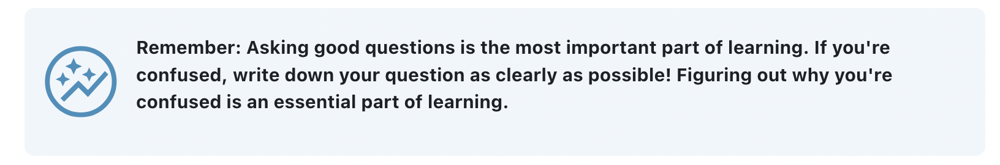

# Styling content for RAISE

In order to maintain consistency and reliability across all RAISE content, the styling associated with RAISE content is consolidated into a series of css classes located in `src/styles`. RAISE Style classes are either written for specific elements, or can be applied to a variety of objects. Those differences are listed below.


***


## Standard Table

Adds a solid border and padding to a table.

**Example**
<div style="text-align: center;">
    
</div>


**Aviliability**
Add as a class atribute to a table html tag.

**Usage**

```html
  <table class="os-raise-standardtable">
  <tr>
    <th>Company</th>
    <th>Contact</th>
    <th>Country</th>
  </tr>
  <tr>
    <td>Alfreds Futterkiste</td>
    <td>Maria Anders</td>
    <td>Germany</td>
  </tr>
  <tr>
    <td>Centro comercial Moctezuma</td>
    <td>Francisco Chang</td>
    <td>Mexico</td>
  </tr>
</table>
```

***

## Gray Box (os-raise-graybox)

Add a Gray box around your element

**Example**
<div style="text-align: center;">
    
</div>

**Availability**
Grayboxes should be used in div elements only


**Usage**
```html
<div class="os-raise-graybox">
    <p> Image Title</p>
    </img>
</div>
```

***

## Indent (os-raise-indent)

Add a padding to the left side of an element. If the element already includes a left padding (like an ordered list) the indent will get set to exactly 2rem

**Example**
<div style="text-align: center;">
    
</div>


**Availability**

Any element

**Usage**

```html
<p class="os-raise-indent">Text in a box</p>
```

***

## No-Indent (os-raise-noindent)

Remove the indent inherent in an ordered list.

**Example**
<div style="text-align: center;">
    
</div>


**Availability**

Ordered list objects

**Usage**

```html
<ol class="os-raise-noindent">
    <li>Item A</li>
    <li>Item B</li>
    <li>Item C</li>
</ol>
```

***

## Motivational Content (os-raise-motivation)

Add a styled motivational message into the content

**Example**
<div style="text-align: center;">
    
</div>

**Availability**

Div objects only

**Usage**

```html
<div class="os-raise-motivation">
    <p>You got this! If you believe that you can figure it out you can!</p>
</div>
```

***

## Side by side (os-raise-d-flex)

Add to any tag surrounding side by side content.

**Example**
<div style="text-align: center;">
    
</div>

**Availability**

Any element

**Usage**

You can append the additional styles to class attribute to add more styling to
the side by side content.

 - `os-raise-align-items-center` centers the side by side content vertically.
 - `os-raise-justify-content-center` centers the grid horizontally.
 - `os-raise-justify-content-between` adds even spacing between content starting after the first element and ending before the last.
 - `os-raise-justify-content-evenly` adds even spacing between content including before the first and after the last element.
```html
<div class="os-raise-d-flex os-raise-align-items-center">
    <p>Element 1</p>
    <p>Element 2</p>
    <p>Element 3</p>
</div>
```

## Centered text (os-raise-text-center)

This utility class can be applied to any element to center content using the [`text-align` CSS property](https://developer.mozilla.org/en-US/docs/Web/CSS/text-align).

**Example**
<div style="text-align: center;">
    
</div>

**Availability**

Any element

**Usage**

```html
<p></p>
<p class="os-raise-text-center"></p>

<table class="os-raise-standardtable">
  <tr>
    <th class="os-raise-text-center">Centered heading</th>
    <th>Default heading</th>
  </tr>
  <tr>
    <td>
      <p>Lorem ipsum dolor sit amet, consectetur adipiscing elit, sed do eiusmod tempor incididunt ut labore et dolore magna aliqua. Ut enim ad minim veniam, quis nostrud exercitation ullamco laboris nisi ut aliquip ex ea commodo consequat. Duis aute irure dolor in reprehenderit in voluptate velit esse cillum dolore eu fugiat nulla pariatur. Excepteur sint occaecat cupidatat non proident, sunt in culpa qui officia deserunt mollit anim id est laborum.</p>
    </td>
    <td>
      <p>Lorem ipsum dolor sit amet, consectetur adipiscing elit, sed do eiusmod tempor incididunt ut labore et dolore magna aliqua. Ut enim ad minim veniam, quis nostrud exercitation ullamco laboris nisi ut aliquip ex ea commodo consequat. Duis aute irure dolor in reprehenderit in voluptate velit esse cillum dolore eu fugiat nulla pariatur. Excepteur sint occaecat cupidatat non proident, sunt in culpa qui officia deserunt mollit anim id est laborum.</p>
    </td>
  </tr>
</table>
```
